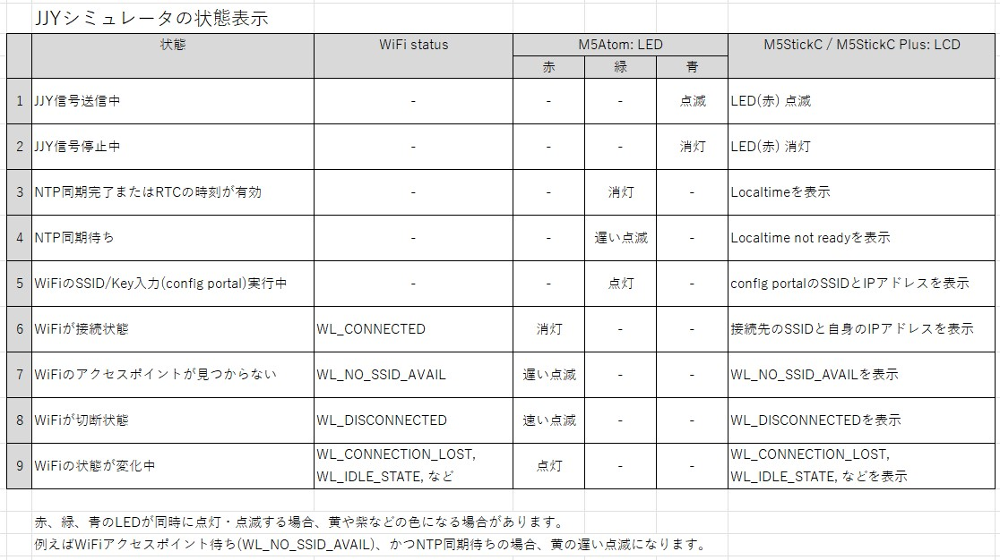

# JJY Simulator for M5StickC, M5StickC Plus and M5StickC Plus2
## M5StickC, M5StickC Plus, M5StickC Plus2で動作する標準電波(JJY)シミュレータ

### 2025/8/15 修正
- Rev.4を追加しました。M5Stack 3.x(Boards Manager)に対応しました。
### 2025/3/03 修正
- BF-018Rev3.ino を修正しました。M5Unifiedの仕様変更に対応しcfg.serial_baudrateの指定を追加しました。
### 2024/3/20 修正
- BF-018Rev3.ino を修正しました。コンパイラ警告レベルをデフォルトよりも上げると、Serial.printf()の%d指定でエラーを検出していました。
### 2024/2/22 修正
- BF-018Rev3を公開しました。M5StickC, M5StickC Plus, M5StickC Plus2に対応しています。
### 2023/10/9 修正
- BF-018Rev2.inoにおいてLCDバックライトに関するライブラリ非互換に対処しました。
### 2023/4/27 修正
- BF-018Rev2.inoにおいてPWMの設定を改善しました。

### Rev.4
- フォルダ: BF-018Rev4
- Boards Managerで、M5Stack 3.xを選択してください。
- M5StickC Plus2, M5StickC Plus, M5StickCで共通にお使いいただけます。
- 機能についてはRev.3から変更ありません。

動作確認状況：

| tool | item | 2025/8/16 |
|:-:|:-:|:-:|
|Application| Arduino-IDE | 2.3.6 |
|Boards Manager| M5Stack by M5Stack official | 3.2.2 |
|Library Manager| M5Unified by M5Stack | 0.2.7  |
|Library Manager| M5GFX by M5Stack | 0.2.9  |
|Library Manager| WiFiManager by tzapu | 2.0.17 |

### Rev.3
- フォルダ: BF-018Rev3
- Rev.4以降をご使用ください。
- Boards Managerで、M5Stack 2.xを選択してください。
- ソース修正不要で、M5StickC, M5StickC Plus, M5StickC Plus2に対応します。
- Arduino IDEのBoards managerで、上記対象のBoardのいずれかを選択してください。
- 機能についてはRev.2から変更ありません。

動作確認状況：

| tool | item | 2025/3/3 |
|:-:|:-:|:-:|
|Application| Arduino-IDE | 2.3.4 |
|Boards Manager| M5Stack by M5Stack official | 2.1.3 |
|Library Manager| M5Unified by M5Stack | 0.2.4  |
|Library Manager| M5GFX by M5Stack | 0.2.6  |
|Library Manager| WiFiManager by tzapu | 2.0.17 |

### Rev.2
- フォルダ: BF-018Rev2
- Rev.4以降をご使用ください。
- M5StickCの場合は、#define M5STICKCPLUS をコメントアウトしてください。
- 変更内容は、「8. Rev2 変更内容」を参照ください

### Rev.1(無印)
- フォルダ: BF-018
- Rev.4以降をご使用ください。
- M5StickCPlusの場合は、#include <M5StickC.h> をコメントアウトして無効にし、#include <M5StickCPlus.h> を有効にしてください。

## 1. 概要
　M5StickC/CPlusで電波時計のためのJJY信号もどきを生成します。JJY信号が届かないところにある電波時計の時刻合わせができます。Wifi経由のNTPで時刻を取得し、GPIOからJJY信号を出力します。
- Qiita [標準電波 JJY もどきを M5StickC / M5Atom の Ticker で生成する](https://qiita.com/BotanicFields/items/a78c80f947388caf0d36)

## 2. ソフトウェア
　開発環境やライブラリの情報は、各Rev.の欄を参照ください。

## 3. ハードウェア
　JJY信号の送信にはアンテナが必要です。GPIO26とGND間に1kΩ程度の抵抗を途中に挟んで1m程度の電線を接続して実験できます。電線を電波時計の至近距離に這わせると電波時計が電線からの磁界を受信してくれます。M5StickC Plusは、M5StickCとは異なり、特にアンテナを接続しなくても時刻が合うことがあります。電波時計の機種にも依るかもしれません。

- 電線と1kΩの抵抗による動作例  
Youtube [JJY Simulator by M5StickC for a radio controlled clock](https://youtu.be/S_t3g5wqyh8)

　アンテナパターンを搭載したプリント基板を作成しました。  

- 電波時計内のバーアンテナの長手方向の延長線上に置いた動作例: 距離70cm  
YouTube [BF-018: JJY Antenna for M5StickC: longitudinal direction](https://youtu.be/LF4P73INSro)

- 電波時計の正面に置いた動作例（M5StickCをストレートコネクタに装着）: 距離30cm  
YouTube [BF-018: JJY Antenna for M5StickC - with straight connecter](https://youtu.be/gpBwHdANwyw)

- 電波時計の正面に置いた動作例（M5StickCをL型コネクタに装着）: 距離30cm  
YouTube [BF-018: JJY Antenna for M5StickC - with right-angle connecter](https://youtu.be/ODojBB31gAc)

## 4. 動作

- 電源投入またはリセット後、まずWifi接続の動作に入ります
- Wifi接続が完了後、NTPで日時を取得し、標準信号の送出を開始します
- JJY信号オンを内蔵LEDでモニターできます

## 5. Wifi 接続
　tzapu/WiFiManagerを使用しています。使い方は、tzapu/WiFiManagerの説明を参照ください。
- GitHub [tzapu/WiFiManager](https://github.com/tzapu/WiFiManager)

## 5. LCD
　ボタンAで状況（SSID, IPアドレス, 日付、時刻, LEDモニタ－オン・オフ）を表示します。約5秒で自動的に表示が消えます。  
※Rev.2では、LEDモニタ－オン・オフの表示を省略しました。また、表示時間を約10秒としました。

## 6. LED
　ボタンBでLEDによるモニターをオン・オフできます。

## 7. シリアルモニタ
　動作の状況を監視できます。

## 8. その他

### (1) WiFi接続についてのリカバリ処理を改善
　WiFiのステータスに応じたリカバリ処理を追加しました。リカバリ処理には5分、10分、あるいはWiFiアクセスポイントが回復するまでなど、長時間を要する場合があります。放置して、いつの間にか正常動作をしていることを目指しています。リカバリ処理の内容は試行錯誤に基づくもので、必ずしもベストではありません。アドバイスなどありましたら是非お知らせください。

- Qiita [ESP32のWiFiおよびtzapu/WiFiManagerにおいて回復処理を試行錯誤した](https://qiita.com/BotanicFields/items/8a73101a8bfe51e57f67)

### (2)  RTCの利用
　電源投入時やリセット時においてWiFiが一時的に接続できないときでも、RTCの時刻に基づいてJJY信号を発信します。このための準備として、NTPの時刻同期のタイミングでRTCの時刻をアップデートします。RTCは、直近のアップデートに基づいた現在時刻を保持しています。M5StickC, M5StickC PlusはRTC(Real Time Clock)を内蔵しています。

- Qiita [ESP32 において NTP の時刻同期を捕まえて RTC を更新する](https://qiita.com/BotanicFields/items/f1e28af5a63e4ccf7023)

### (3) SSID/Keyを消去する操作
　接続先のWiFiアクセスポイントを変更する場合、SSID/Keyの設定を変更します。古いアクセスポイントが撤去済の場合、WiFiManagerのconfigration portalが自動的に起動します。古いアクセスポイントが稼働中の場合、まずEEPROMに保存されたSSID/Keyの消去することで新規設定ができます。EEPROMのSSID/Keyを消去するには、ボタンAを押しながら電源オンし"SSID/Key erased"が表示されるまでボタンAを押し続けます。まもなく"configuration portal"が起動します。

### (4) 40kHzを使用
　JJY信号は、福島県の送信所から40kHz、佐賀県の送信所から60kHzで送信されています。PWM周波数は40kHzとしています。ESP32では60KHzぴったりの信号を生成できませんが、かなり近い周波数で生成できます。東日本の場合、疑似JJY信号を60kHzとすることで、福島からの信号に同期したのか、疑似信号に同期したのかを区別することができます。疑似信号を60kHzに設定するには、BF-018ARevN.inoのjjy_frequencyを60000に修正ください。

```
// for TCO(Time Code Output)
const uint32_t jjy_frequency(40000); // 40kHz(east), 60kHz(west)
```

　ledcのfrequenncyの型がdoubleからuint32_tに変更されました。

参考: Qiita [ESP32においてLEDC(LED PWM Controller)に設定する分解能をExcelシートで検討する](https://qiita.com/BotanicFields/items/e74c449c0bef0820fcd1)

### (5) LCD表示

- WiFiの接続状態を表示  
WL_CONNECTED以外の場合、LCDの最上段に赤字で表示
- config portalの情報を表示  
WiFiManagerがconfig portalを起動した場合、アクセス先のSSIDとIPアドレスを表示

詳細: [JJYシミュレータの状態表示]

### (6) M5StickC PlusのLCD表示の文字の大きさ
　GFXFontを使用して適当な大きさの文字で表示する様にしました。フォルダにFree_Fonts.hを含めていますが、M5StickC Plusのライブラリの次回リリースで取り込まれると思いますので、それ以降は削除して参照部分も修正する予定です。

- GitHub [Free_Fonts.h missing](https://github.com/m5stack/M5StickC-Plus/issues/38)


以上